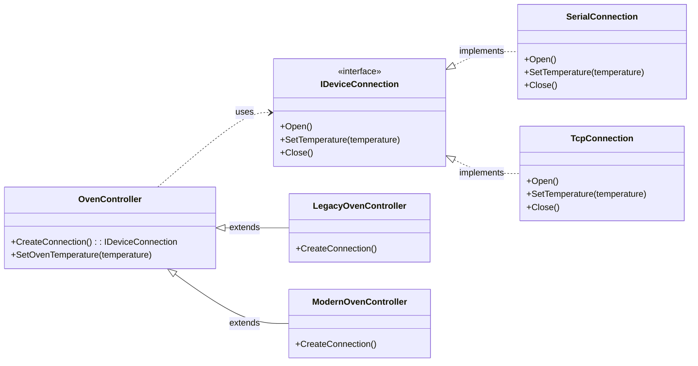

# DesignPatterns_LabVIEW
Sample code of design patterns realized in LabVIEW

# Factory method

```mermaid
classDiagram
    direction LR

    class IDeviceConnection {
    <<interface>>
        +Open()
        +SetTemperature(temperature)
        +Close()
    }

    class SerialConnection {
        +Open()
        +SetTemperature(temperature)
        +Close()
    }

    class TcpConnection {
        +Open()
        +SetTemperature(temperature)
        +Close()
    }

    class OvenController {
        +CreateConnection() : IDeviceConnection
        +SetOvenTemperature(temperature)
    }


    
    class LegacyOvenController {
        +CreateConnection()
    }

    class ModernOvenController {
        +CreateConnection()
    }

    IDeviceConnection <|.. SerialConnection : implements
    IDeviceConnection <|.. TcpConnection : implements

    OvenController <|-- LegacyOvenController : extends
    OvenController <|-- ModernOvenController : extends

    OvenController ..> IDeviceConnection : uses


```
